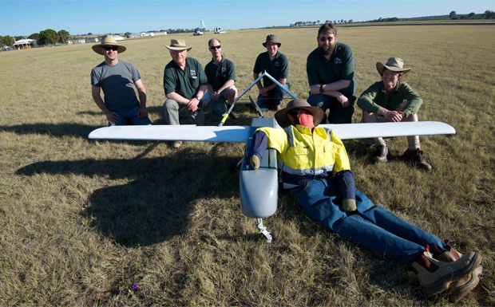

.. _obc2012:

2012 UAV Outback Challenge
==========================

CanberraUAV was formed to campeign for the 2012 UAV Outback Challenge, an international amateur UAV search and rescue competition. We won first place and were awarded perfect score for the search component, but suffered a malfunction that prevented us from acomplishing the rescue component.

The 2014 competition was announced on 27/02/2013, we will enter and expect to improve on our 2012 performance.

The above image shows the team members present at the awards ceremony on day 3 of the competition, it doesn't include the members that had to travel home before them, or the wider community that contributed to our efforts.

For more information about the event:
 * The official competition web site http://www.uavoutbackchallenge.com.au/
 * CanberraUAV mission statement: http://canberrauav.com/about
 * OBC Wikipedia article http://en.wikipedia.org/wiki/UAV_Outback_Challenge
 * DIYDrones writeup (technical/enthusiast audience) http://diydrones.com/profiles/blogs/canberrauav-outback-challenge-2012-debrief
 * Sydney Morning Herald (general public audience) http://www.smh.com.au/technology/technology-news/drone-finds-dummy-bushwalker-in-worldfirst-20121005-273lv.html
 * South Burnett Times (general public, Kingaroy local paper) http://southburnett.com.au/news2/2012/10/outback-joe-found-but-not-saved/ 

Deliverables
------------

The competition requires passing various development and documentation milestones prior to the event. These are the documents we submitted:

 * :download:`D1 (word 2010) <OBC2012/deliverable_1_report_draft_6_editable.docx>`, :download:`D1 (PDF) <OBC2012/deliverable_1_report_final.pdf>`
 * :download:`D2 (word 2010)<OBC2012/deliverable_2_final_2.docx>`, :download:`D2 (PDF)<OBC2012/deliverable_2_final.pdf>`
 * :download:`D3 (word 2010)<OBC2012/deliverable_3_v4.docx>`, :download:`D3 (PDF)<OBC2012/deliverable_3_v3.pdf>`

Procedures and Reference
------------------------

We also created the following documents for our own use at the competition (and practice flights):

 * :download:`Procedures document (word 2010)<OBC2012/uav_procedures.docx>`
 * :download:`Items to bring to testing days (word 2010)<OBC2012/items_to_bring.docx>`

After the Challenge
-------------------

In adition to Tridge's writeup on DIYDrones, we documented our post-competition review here: 

 * :download:`Debrief (word 2010)<OBC2012/canberrauav_notes_debrief.docx>`
